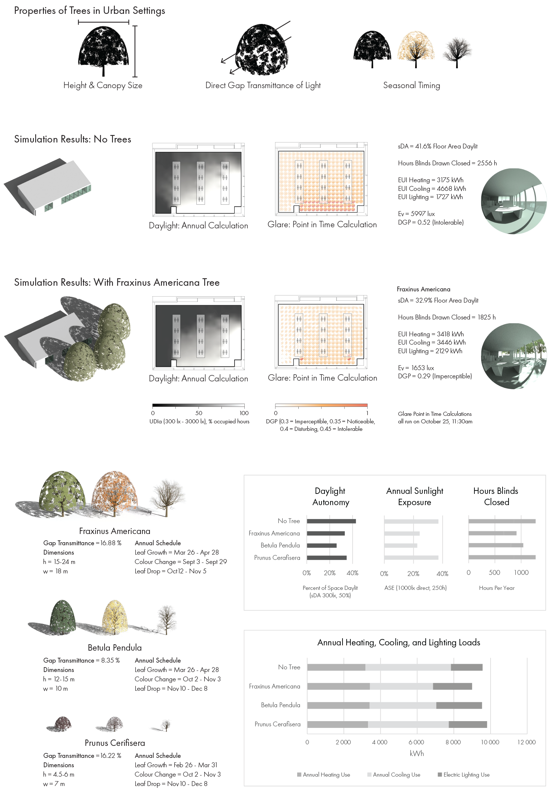

# tree_database
Measured information on 12 common tree species from Vancouver, 3D models thereof, and the code to generate them.

## Terms of use
The code is licensed under the MIT license. For use of the code in research, please cite our associated publication from eSim 2022: [Simulating the Impact of Deciduous Trees on Energy, Daylight, and Visual Comfort: Impact Analysis and a Practical Framework for Implementation](https://www.dropbox.com/s/4klonawms9kbud0/Pan%20%26%20Jakubiec%20-%20Simulating%20the%20Impact%20of%20Deciduous%20Trees%20on%20Energy%2C%20Daylight%2C%20and%20Visual%20Comfort-%20Impact%20Analysis%20and%20a%20Practical%20Framework%20for%20Implementation.pdf?dl=1)

## Contents
The project root folder contains measured or estimated data for the twelve tree species, including canopy gap fraction, leaf clustering, and color-change/drop/regrowth schedules (`Canopy and Schedules.xlsx`), parameters used to generate branch systems based on a modified version of [proctree.js](https://github.com/supereggbert/proctree.js/) (`Branch Parameters.xlsx`), and measured leaf color data (`Colour Measurements.xlsx`).

A subfolder, `Tree Generator/`, contains a Rhino-Grasshopper script to generate branch and tree canopy mesh geometries based on user input parameters. This includes a modified port of [proctree.js](https://github.com/supereggbert/proctree.js/) to Python and a call to an external custom version of [gen_tree](https://github.com/C38C/gen_tree). To use this script, you must have Python (>=2.7) installed with the Numpy and Scipy modules.

## Dependencies
- Rhinoveros 3D & Grasshopper
- Python `>= 2.7`
- Numpy & Scipy

